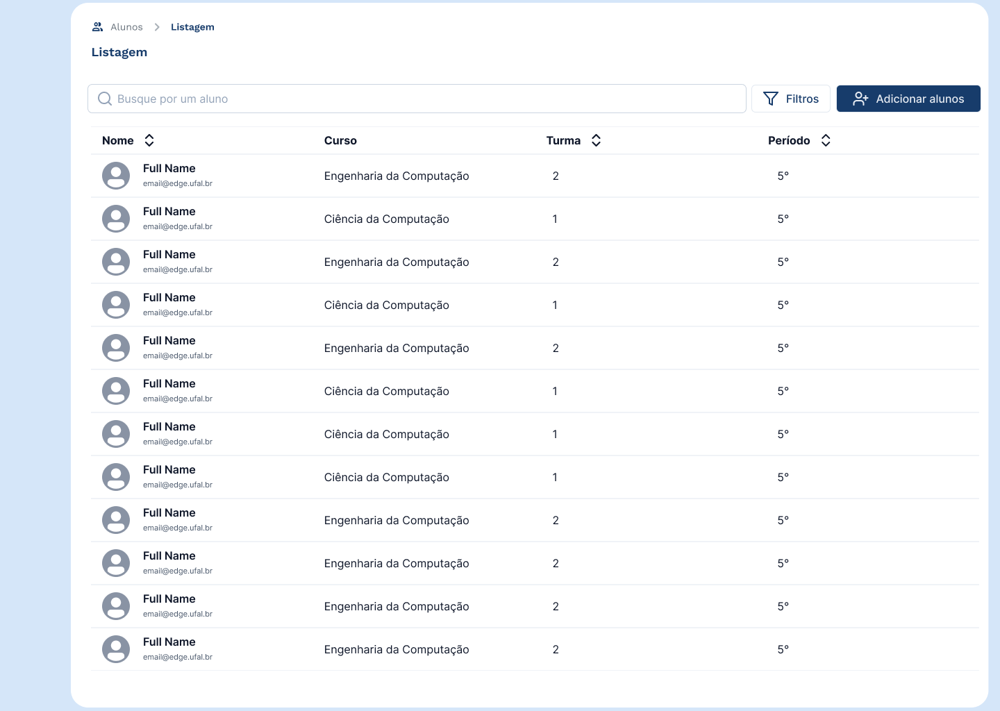
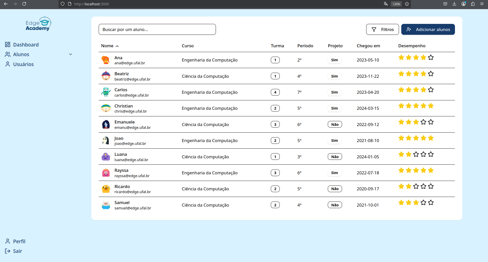

# 🧩 Componentes Myna/ShadCN Utilizados

- `Button`
- `Table`, `TableHeader`, `TableBody`, `TableRow`, `TableHead`, `TableCell`
- `Avatar`, `AvatarFallback`, `AvatarImage`
- `Badge`
- `Input`
- `DropdownMenu`
- Componente customizado de `Star`

---

## ⚠️ Dificuldades Enfrentadas

- Problemas com `npx tailwindcss init -p`
- Conflitos de dependência com `@mynaui/icons-react` e React 19
- Componentes não encontrados com `npx shadcn add` (ex: `star`)
- Customização com cores específicas exigiu uso manual de `style={{}}`
- Problemas com caminhos relativos a imagens (uso incorreto de `~`)

---

## ✅ Prós

- Componentes visuais **bonitos**, **modernos** e de fácil customização
- Compatível com Tailwind CSS e Radix UI (ótima acessibilidade)
- CLI (`shadcn`) facilita a geração e inserção de novos componentes
- Versão gratuita **completa o suficiente para MVPs**
- Layouts **muito adaptáveis** aos requisitos do projeto

---

## ❌ Contras

- Alguns componentes **pagos**, e os mais avançados estão nessa categoria
- Componentes como `star` não disponíveis por padrão no CLI
- Integração inicial pode ser confusa para quem nunca usou o sistema
- Documentação oficial do CLI às vezes pouco detalhada

---

## ✍️ Minha Opinião

Tive uma dificuldade inicial para configurar as dependências, mas acho que foi mais por nunca ter feito isso antes. No mais, é muito tranquilo. Todos os modelos que o Myna oferece são muito bons e adaptáveis.

O único defeito é que algumas coisas são pagas — mas as que são pagas são incríveis. Se for possível pagar, com certeza vai valer muito a pena. No mais, a versão gratuita é muito boa, e fica aqui meu voto para utilizarmos o Myna.

---

## 🚀 Como rodar o projeto localmente

### 1. Clone o repositório
```bash
git clone https://github.com/IsHirog/dashboard-myna.git
cd dashboard-myna
```

### 2. Instale as dependências
```bash
npm install
```

### 3. Rode o projeto
```bash
npm run dev
```

### 4. Acesse no navegador
```
http://localhost:3000
```

---

## 📁 Estrutura esperada

- `/src/app`: principais páginas e entrada do projeto
- `/src/components/ui`: componentes do Myna UI utilizados e customizados
- `/public/avatars`: imagens dos usuários

---

Se houver `.env` ou chaves específicas no futuro, instruções serão adicionadas aqui.

---

Para dúvidas, ajustes ou melhorias, sinta-se à vontade para abrir um issue ou pull request 🚀
---

## 📸 Print da tela principal

Coloque sua imagem na pasta `assets/` e use o seguinte código no README:

```markdown

```

Se preferir usar uma imagem externa:

```markdown

```

Certifique-se de que o caminho está correto e a imagem está no repositório ou acessível publicamente.

---

## 📸 Prints da Interface

### 🎯 Inspiração visual



### 🧪 Resultado final



---

